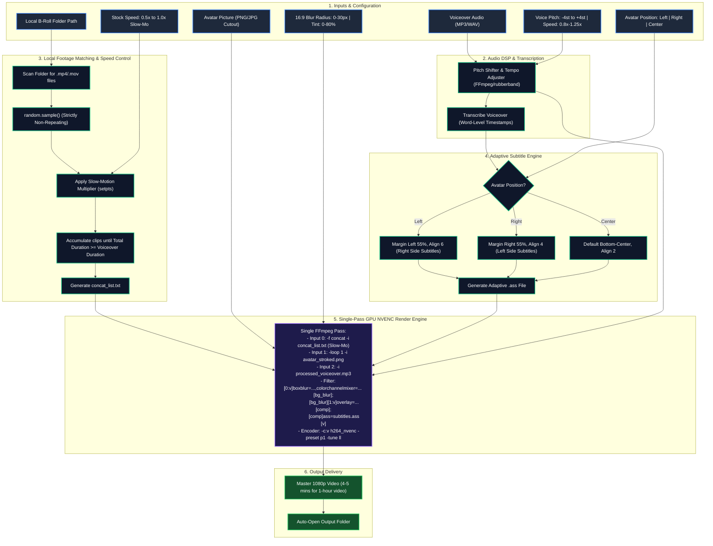

# 🚀 Standalone Avatar Storyteller Engine — Master Architecture Plan

## 1. Overview & Concept
A dedicated, ultra-high-speed faceless video generator engineered for **Author / Storyteller / Faceless** channels (e.g., Philosophy, Reddit Stories, Podcasts, Motivation, Business Case Studies).

### Key Differentiators from Standard Video Generators:
1. **Local B-Roll Footage Pool**: Zero API latency, zero download wait times. Randomly selects non-repeating clips from a local folder to fill exact audio duration.
2. **Host / Author Avatar Picture with Stroke**: Upload an author/expert image with **Left**, **Right**, or **Center** placement. Includes an **automatic outer stroke / glow border** (white/cyan/gold) so the portrait pops out and never blends into the background.
3. **Cinematic Background Blur & Opacity**: Optional background blur (`boxblur`) and dimming overlay (e.g. 35% dark tint) applied strictly to the stock video footage across the entire 16:9 canvas — keeping the avatar and captions 100% crisp, razor-sharp, and legible.
4. **Smart Adaptive Captions**: Subtitles automatically position themselves in the remaining free space opposite to the avatar (Avatar Left ➔ Subtitles Right; Avatar Right ➔ Subtitles Left; Avatar Center ➔ Bottom Center).
5. **Stock Video Slow-Motion Multiplier**: Ability to slow down stock footage speed (e.g., `0.5x`, `0.75x`, `0.85x`, `1.0x`) for a calm, hypnotic, documentary aesthetic.
6. **Voiceover Pitch & Speed Tuning**: Real-time voice pitch shifter (deep radio bass `-4 st` to `+4 st`) and speed controller (`0.8x` to `1.25x`).
7. **Single-Pass GPU Turbo Engine**: 1-hour 1080p video renders in **4 to 5 minutes** on a standard 4GB GPU (Nvidia NVENC / Intel QSV / AMD AMF).

---

## 1.1 Author / Storyteller Sub-Categories & Niche Catalogue

The Author Storyteller engine is designed for high-retention long-form storytelling across these specialized niches:

| # | Sub-Category / Niche | Typical Audio Style | Recommended Background & Avatar Mood |
| :--- | :--- | :--- | :--- |
| 1 | **Stoicism & Ancient Philosophy** | Deep, slow, reflective narration (Marcus Aurelius, Seneca) | Dark classical statues, ancient ruins, candlelight, bronze/gold avatar stroke |
| 2 | **Dark Psychology & Mind Science** | Measured, mysterious, analytical tone | Slow smoke, brain scans, shadowy figures, cold cyan/white avatar stroke |
| 3 | **Motivation, Grit & Self-Mastery** | Energetic, resolute, disciplined speech | Early dawn runs, gym silhouettes, rain-soaked asphalt, electric yellow stroke |
| 4 | **Narrative Storytelling & Reddit Mysteries**| First-person conversational, suspenseful | Night streetlights, lonely diner, dark forests, soft white avatar border |
| 5 | **True Crime & Historical Investigations** | Documentary, dramatic investigative pacing | Old newspapers, archival rooms, noir street corners, vintage gold stroke |
| 6 | **Business Case Studies & Moguls** | Professional, authoritative, case analysis | Modern skyscrapers, trading floors, luxury suites, sharp silver/white stroke |
| 7 | **Sci-Fi & Cosmic Philosophy** | Thought-provoking, awe-inspiring questions | Hubble galaxies, space stations, quantum simulations, neon purple/cyan stroke |
| 8 | **Horror & Paranormal Stories** | Slow whispering tension, eerie pauses | Foggy pine trees, abandoned halls, flickering lights, eerie dark red/white stroke |
| 9 | **Wealth & Financial Psychology** | Analytical, wise, Morgan Housel style | Vault doors, currency printing, calm executive desks, champagne gold stroke |

---

## 2. System Architecture & High-Level Flowchart



---

## 3. Core Technical Modules & Implementation Details

### Module 1: Local Footage Selector (`backend/local_pool.py`)
```python
import os, random
from pathlib import Path
import mutagen.mp3  # or ffprobe for audio duration

def select_local_clips(folder_path: str, target_duration_sec: float, speed_multiplier: float = 1.0) -> list:
    """
    Scans folder, shuffles clips randomly without repeating any clip,
    accounts for slow-motion speed stretching, and returns exact list
    of clips matching voiceover duration.
    """
    valid_exts = {".mp4", ".mov", ".mkv", ".webm"}
    all_clips = [p for p in Path(folder_path).glob("*") if p.suffix.lower() in valid_exts]
    if not all_clips:
        raise FileNotFoundError(f"No video clips found in {folder_path}")
    
    # Shuffle without replacement (Strictly zero repeats)
    random.shuffle(all_clips)
    
    selected = []
    accumulated_dur = 0.0
    
    for clip in all_clips:
        raw_clip_dur = get_clip_duration(clip) # fast ffprobe
        # If speed is slowed to 0.75x, the effective duration on screen is raw_dur / 0.75
        effective_dur = raw_clip_dur / max(0.2, speed_multiplier)
        selected.append({
            "path": str(clip.resolve()),
            "raw_duration": raw_clip_dur,
            "effective_duration": effective_dur
        })
        accumulated_dur += effective_dur
        if accumulated_dur >= target_duration_sec:
            break
            
    return selected
```

---

### Module 2: Adaptive Subtitle Director (`backend/adaptive_subtitles.py`)
- **Left Avatar**:
  - Avatar occupies `X: 40px to 800px` (or left 40% of screen).
  - Subtitles occupy `X: 960px to 1880px` (`MarginL=960`, `MarginR=60`, `Alignment=5` or `6`).
- **Right Avatar**:
  - Avatar occupies `X: 1120px to 1880px` (right 40% of screen).
  - Subtitles occupy `X: 60px to 1000px` (`MarginL=60`, `MarginR=960`, `Alignment=4` or `5`).
- **Center Avatar**:
  - Avatar placed at center or bottom-center.
  - Subtitles placed at bottom-center (`MarginV=50`, `Alignment=2`).

---

### Module 2.1: Avatar Outer Stroke & Glow Border Generator (`backend/avatar_processor.py`)
To prevent the avatar from merging into dark or bright stock backgrounds, an automated crisp outer stroke border (White, Cyan, or Gold) is generated:
```python
from PIL import Image, ImageFilter, ImageOps

def add_avatar_stroke(input_image_path: str, stroke_color=(255, 255, 255, 255), stroke_width=8) -> str:
    """
    Takes transparent PNG portrait and adds a clean, sharp outer border
    so it stands out distinctly against any video background.
    """
    img = Image.open(input_image_path).convert("RGBA")
    # Expand alpha mask to create stroke
    alpha = img.split()[-1]
    stroke_mask = alpha.filter(ImageFilter.MaxFilter(stroke_width * 2 + 1))
    stroke_img = Image.new("RGBA", img.size, stroke_color)
    stroke_img.putalpha(stroke_mask)
    # Composite original avatar on top of stroke
    stroke_img.alpha_composite(img)
    
    out_path = input_image_path.replace(".png", "_stroked.png")
    stroke_img.save(out_path, format="PNG")
    return out_path
```

---

### Module 3: Voiceover Pitch & Speed DSP Shifter (`backend/audio_dsp.py`)
Allows user to deepen voice (e.g. for cinematic mystery or philosophy) or adjust playback pace:
```python
import subprocess

def process_voiceover_audio(input_audio: str, output_audio: str, pitch_semitones: float = 0.0, speed_rate: float = 1.0) -> str:
    """
    Adjusts voiceover audio pitch (in semitones) and tempo (0.8x - 1.25x).
    Uses high-quality FFmpeg rubberband or asetrate/atempo DSP math.
    """
    filters = []
    
    # Pitch shift math: 2^(semitones / 12)
    if abs(pitch_semitones) > 0.05:
        # e.g., -2 semitones gives deep radio broadcaster voice
        factor = 2.0 ** (pitch_semitones / 12.0)
        # asetrate shifts both pitch and speed; atempo restores original speed
        sample_rate = 44100
        new_rate = int(sample_rate * factor)
        compensate_tempo = 1.0 / factor
        filters.append(f"asetrate={new_rate},atempo={compensate_tempo}")
        
    if abs(speed_rate - 1.0) > 0.02:
        filters.append(f"atempo={speed_rate}")
        
    if not filters:
        return input_audio  # No modification needed
        
    filter_str = ",".join(filters)
    cmd = [
        "ffmpeg", "-y", "-i", input_audio,
        "-af", filter_str,
        "-c:a", "libmp3lame", "-b:a", "192k",
        output_audio
    ]
    subprocess.run(cmd, check=True)
    return output_audio
```

---

### Module 4: Entire 16:9 Background Blur & Stock Slow-Mo Engine (`backend/fast_renderer.py`)
Instead of multi-pass rendering, everything is executed in **ONE SINGLE HIGH-SPEED FFmpeg FILTERGRAPH PASS**:
```bash
ffmpeg -y \
  -f concat -safe 0 -i concat_list.txt \
  -loop 1 -i avatar_stroked.png \
  -i processed_voiceover.mp3 \
  -filter_complex "\
    [0:v]setpts=1.33*PTS,boxblur=luma_radius=12:chroma_radius=12,colorchannelmixer=aa=0.80[bg_blur]; \
    [bg_blur][1:v]overlay=x=60:y=(H-h)/2:shortest=1[comp]; \
    [comp]ass='adaptive_subs.ass'[vout]" \
  -map "[vout]" -map 2:a:0 \
  -c:v h264_nvenc -preset p1 -tune ll -rc cbr -b:v 8M -pix_fmt yuv420p \
  -c:a aac -b:a 192k \
  -shortest output_1hour.mp4
```

### Why This Architecture is Revolutionary for 1-Hour Videos:
1. **Entire 16:9 Screen Blur (`boxblur`)**:
   - `boxblur=luma_radius=12:chroma_radius=12` softens the entire background stock footage across 1920x1080.
   - `colorchannelmixer=aa=0.80` dims the background footage by 20% so it acts as an elegant ambient canvas.
2. **Avatar & Subtitle Isolation**:
   - The blur filter is applied **exclusively to Stream `[0:v]` (the stock b-roll)**.
   - The Avatar image `[1:v]` is composited **on top** of `[bg_blur]`.
   - The ASS subtitles are burned **on top** of `[comp]`.
   - **Result**: Background is smooth and cinematic; Avatar portrait and CapCut captions are 100% razor sharp and crisp!
3. **Cinematic Slow-Motion (`setpts=1.33*PTS`)**:
   - Slowing down footage to `0.75x` eliminates distracting jerky movements from stock clips, making 1-hour videos look like high-budget Netflix documentaries.
4. **400-500 FPS Throughput on standard 4GB GPU**:
   - Concat demuxer reads local NVMe files at zero network latency.
   - Hardware accelerated NVENC/QSV/AMF encodes 1-hour video (108,000 frames) in **4 to 5 minutes**!

---

## 3.1 Proven Modules to Borrow from VideoGen Studio

When building the standalone Avatar engine, you can directly reuse these battle-tested components from VideoGen Studio (`c:\Users\Abid\Desktop\vg`):

1. **Groq Whisper Micro-Timestamp Transcriber** (`backend/transcriber.py`):
   - Transcribes long audio with word-level start/end timestamps in ~2 seconds.
2. **CapCut ASS Kinetic Subtitle Engine** (`backend/subtitle_generator.py`):
   - 12 viral presets (CapCut Yellow, Hormozi Green, Neon Cyber, Ali Abdaal, Luxury Gold).
   - Word highlight animations (`\k` karaoke tags), custom font kerning, and strokes.
3. **GPU Hardware Encoder Auto-Detector** (`backend/config.py` & `backend/video_renderer.py`):
   - Automatically probes and detects `h264_nvenc` (NVIDIA), `h264_qsv` (Intel), `h264_amf` (AMD), or fallback `libx264` (CPU).
4. **Desktop Edge App Launcher** (`desktop_launcher.py`):
   - Zero-install standalone desktop launch mode without browser address bar distractions.

---

## 4. Proposed User Interface (UI Wireframe)

```
┌──────────────────────────────────────────────────────────────────────────────┐
│  ⚡ AVATAR STORYTELLER ENGINE                         [⚙️ Settings] [📂 Outputs]│
├──────────────────────────────────────────────────────────────────────────────┤
│                                                                              │
│  [ STEP 1: VOICEOVER & AUDIO TUNING ]                                         │
│  📁 Drag & Drop Voiceover Audio (.mp3, .wav)                                 │
│  Detected Duration: 58 mins 24 secs (3,504 seconds)                          │
│  🎚️ Voice Pitch:  [ -4st (Deep Bass) ━━━━━●━━━━━ +4st (High) ]  Current: -1.5st│
│  ⏱️ Voice Speed:  [ 0.8x ━━━━━━━━━●━━━━━━━ 1.25x ]             Current: 1.0x │
│                                                                              │
│  [ STEP 2: AVATAR / AUTHOR PORTRAIT ]                                        │
│  🖼️ Upload Portrait Image (PNG cutout / JPG portrait)                       │
│  Placement:    [ ⬅️ Left (40%) ]   [ ⏺️ Center ]   [ ➡️ Right (40%) ]         │
│  Outer Stroke: [ ⚪ Clean White ]  [ 🟡 Gold Glow ]  [ 🔵 Cyan Glow ] [ None ]│
│                                                                              │
│  [ STEP 3: LOCAL B-ROLL POOL & CINEMATIC MOTION ]                            │
│  📂 Local Folder: [ D:/Stock_Clips/Dark_Aesthetic_1080p ] [Browse Folder]     │
│  Clips Available: 142 videos (Avg 45s) • No repeats needed: 52 clips         │
│  🐢 Stock Speed:  [ 0.5x Slow ━━━━━●━━━━━ 1.0x Normal ]        Current: 0.75x │
│  🌫️ 16:9 Blur:    [ 0px (Off) ━━━━━━━●━━━━━ 25px (Heavy) ]     Current: 12px  │
│  🌑 Dark Tint:    [ 0% ━━━━━━━━━━━━━━●━━━━━ 80% Dark ]         Current: 25%   │
│                                                                              │
│  [ STEP 4: ADAPTIVE CAPTION STYLES ]                                         │
│  Preset: [ 🔥 CapCut Viral Yellow ] [ 🟢 Hormozi ] [ 💼 Ali Abdaal ] [ 🏛️ Stoic ]│
│  Layout: ⚡ Smart Auto-Positioning (Captions placed opposite to Avatar)       │
│                                                                              │
│  ──────────────────────────────────────────────────────────────────────────  │
│  [ 🚀 RENDER 1-HOUR VIDEO (GPU TURBO) ]                                      │
│  ⚡ Estimated Single-Pass Encoding Time: ~4 minutes 30 seconds               │
│                                                                              │
└──────────────────────────────────────────────────────────────────────────────┘
```

---

## 5. Implementation Roadmap (Phase-by-Phase)

### Phase 1: Local B-Roll Scanner & Concat Generator
- Scan specified local directory for `.mp4`, `.mov`, `.mkv`.
- Implement non-repeating shuffle accumulator matching target audio duration.
- Benchmark `setpts` slow-motion calculation.

### Phase 2: Audio DSP & Whisper Micro-Transcription
- Implement pitch shifting (`rubberband` / `asetrate` semitone math) and tempo adjuster.
- Wire Groq Whisper Large v3 for word-level timestamps.

### Phase 3: Avatar Processor & Outer Stroke Generator
- Transparent PNG loader with alpha mask dilation (`ImageFilter.MaxFilter`).
- Outer stroke border drawing (White, Gold, Cyan) with customizable width.

### Phase 4: Adaptive Subtitle Engine
- Generate ASS subtitles with dynamic margins:
  - If Avatar Left: `MarginL=960`, `MarginR=60`.
  - If Avatar Right: `MarginL=60`, `MarginR=960`.
  - If Avatar Center: Bottom center `MarginV=50`.

### Phase 5: Single-Pass FFmpeg GPU Turbo Renderer & UI
- Build the unified single-pass filtergraph with background blur, slow-mo, avatar overlay, and subtitle burn.
- Single-page dark mode UI with interactive sliders, folder picker, and instant preview.

---

## 6. Ready-to-Paste Claude Kickoff Prompt for New Chat

When opening a **new chat** with Claude to start building the standalone engine, paste the following prompt:

```markdown
I want to build a brand new standalone desktop tool: "Avatar Storyteller Video Engine".
It is an ultra-fast, single-pass video generator for long-form (30-min to 1-hour) faceless YouTube storytelling channels (Stoicism, Philosophy, Psychology, True Crime, Reddit Stories, Business Case Studies).

The complete architectural blueprint and specifications are in:
NEW_AVATAR_VIDEO_ENGINE_PLAN.md

Key Architecture Highlights:
1. Local B-roll folder pool (zero API latency, strictly non-repeating random clips matching audio duration).
2. Host/Author Avatar picture (Left, Right, or Center) with automated outer stroke/glow border so it pops out.
3. Full 16:9 canvas background blur slider (0-30px) + dark tint (0-80%) applied strictly to the stock video layer — Avatar and Captions remain 100% crisp and razor sharp!
4. Stock footage slow-motion speed slider (0.5x to 1.0x).
5. Voiceover audio pitch adjustment (-4st to +4st) and tempo control.
6. Smart adaptive subtitles (Captions automatically position opposite to the Avatar).
7. Single-pass GPU hardware acceleration (NVENC/QSV/AMF) rendering a 1-hour 1080p video in 4 to 5 minutes!

Please start with Phase 1:
Create the standalone project skeleton, local B-roll folder scanner, duration accumulator with slow-mo math, and verify it with a real test run.
```

---
*Maintained by Antigravity AI • Standalone Avatar Storyteller Engine Master Specification*
